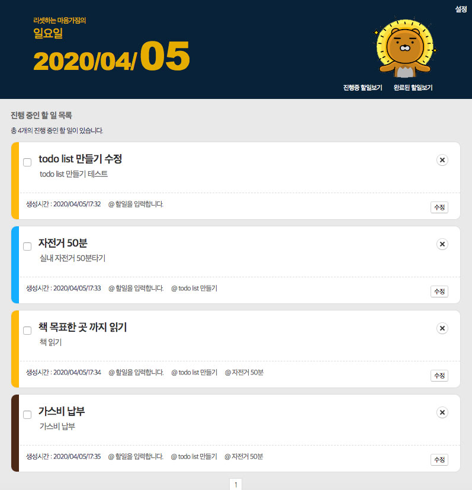

# vue_todo
vue , vue-router , vuex , localstorage(createPersistedState , SecureLS 사용 암호화 저장)

* 할일의 제목과 내용은 필수 입력요소
* 최대 3개의 할일을 참조 할 수 있고 참조한 할일이 완료되어야 완료될 수 있다.
* 범주와 색상을 지정해서 할일 카드에 표시 할 수 있다.
* 상세보기에서 생성일자와 수정일자가 표시되고 수정을 할 수 있다.
* 상단 설정을 통해 요일별 문구를 사용자 설정으로 바꿀 수 있고 추가한 범주를 관리할 수 있다.
* 완료된 할일과 진행할 할일 별로 볼수있다.

## Demo


## Project setup
```
npm install
```

### Compiles and hot-reloads for development
```
npm run serve
```

### Compiles and minifies for production && netlify deploys
```
npm run build
```

